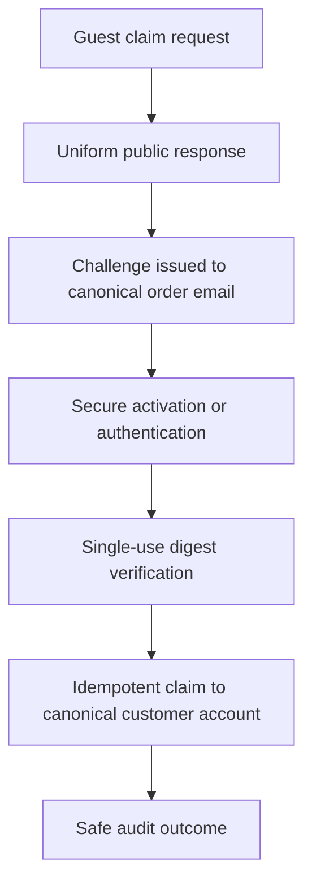

# Account claim flow v1

This contract allows a future guest order to be associated with its canonical
customer account without treating email and order number as proof of access.

## Security contract

1. The public request reveals neither order existence nor order details.
2. Email plus order number never grants access.
3. Future challenge delivery uses the email already canonical to the order, not
   an address supplied as authority by the requester.
4. The entity stores only `TokenDigest`; raw challenge material is never stored
   or placed in audit metadata.
5. The challenge is single-use and has an explicit expiry.
6. Completion requires an active authenticated identity or a secure activation
   path.
7. The order can be linked only to the canonical customer account belonging to
   that operation.
8. Completion is idempotent; retrying a completed claim returns the same safe
   state without repeating side effects.
9. Expired, revoked, failed, or already-used challenges grant nothing.
10. Retries and failures expose no order data and produce a safe audit outcome.

## ZP-03A boundary

No endpoint, email delivery, challenge generator, hash implementation,
identity-provider integration, database repository, order lookup, or real token
exists in this phase. Tests use reserved data and deterministic in-process
fakes only.
